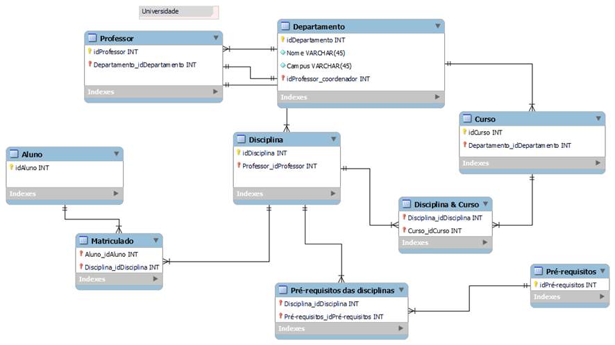

# Resolução do Lab Project: Dashboard de Vendas com Power BI utilizando Star Schema
## Bootcamp NTT DATA - Engenharia de Dados com Python

### Introdução
Este repositório contém minha solução para o lab project solicitado no Bootcamp NTT DATA - Engenharia de Dados com Python de acordo com suas regras descritas abaixo.

Apesar do título sugerir que este desafio se trata de um Dashboard de vendas, na verdade se refere ao desenvolvimento de um diagrama dimensional com base no seguinte diagrama relacional (arquivo universidade.mwb):

### Tecnologia

### Objetivo do Lab Project
o Foco desta modelagem dimensional deve ser o Professor.
- A tabela fato deve refletir diversos dados sobre o professor, cursos ministrados, departamento ao qual faz parte.
- Não é necessário relfetir dados sobre os alunos.
- Deverá ser criada a tabela de Fatos que contêm o contexto analisado.
- Criar as tabelas Dimensão que serão compostas pelos detalhes relacionados ao contexto.
- Adicionar uma tabela dimensão de datas. Parra compensar a falta de dados de datas do modelo relacional, suponha que você tem acesso aos dados e crie os campos necessários para modelagem.
    - Exemplo: data de oferta das disciplinas, data de oferta dos cursos, entre outros
    - A granularidade não está fixada. Podem ser utilizados diferentes formatos que correspondam a diferentes níveis de granularidade.

### Descrição da Resolução  
- Os arquivos deste repositório correspondem às minhas soluções para este desafio de projeto:
    - EER_StarSchema_Professor.png => arquivo que contém a imagem de minha solução, representando o star schema que modelei.
    - universidade_StarSchema_Professor.mwb => arquivo exportado do MySQL Workbench, contendo a minha modelagem
    - universidade.mwb => modelo relacional original, base do desafio.